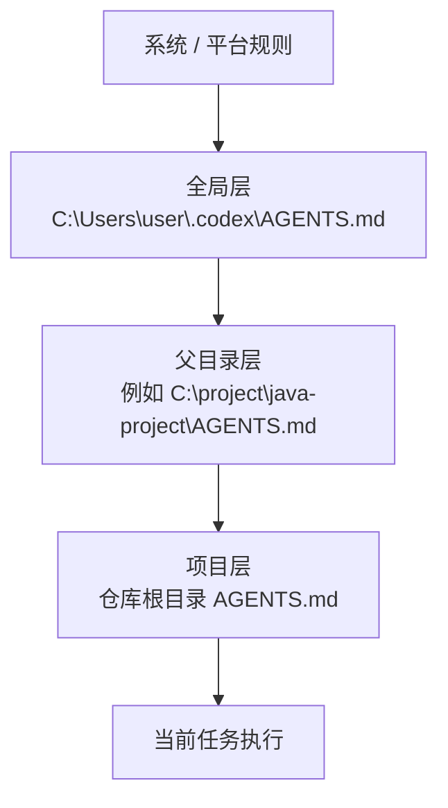
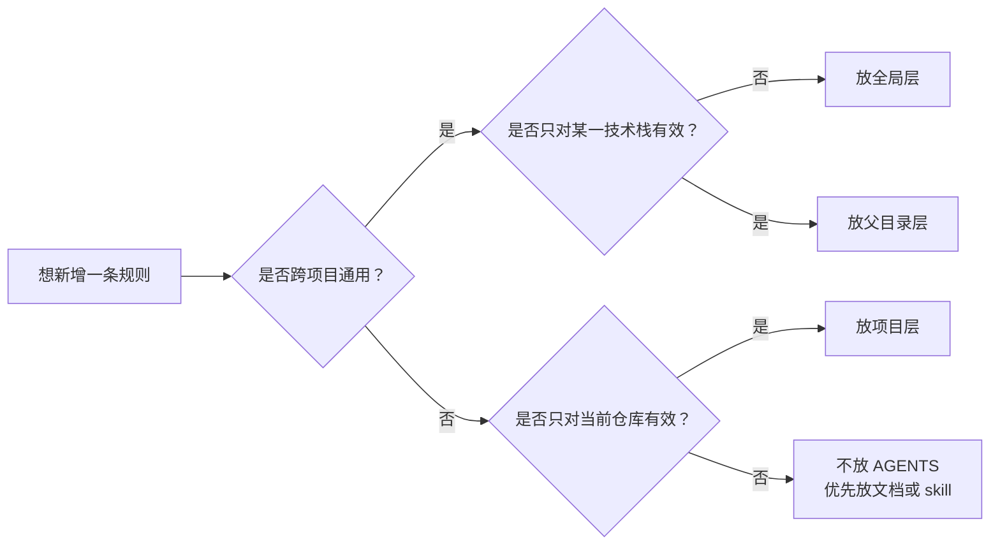
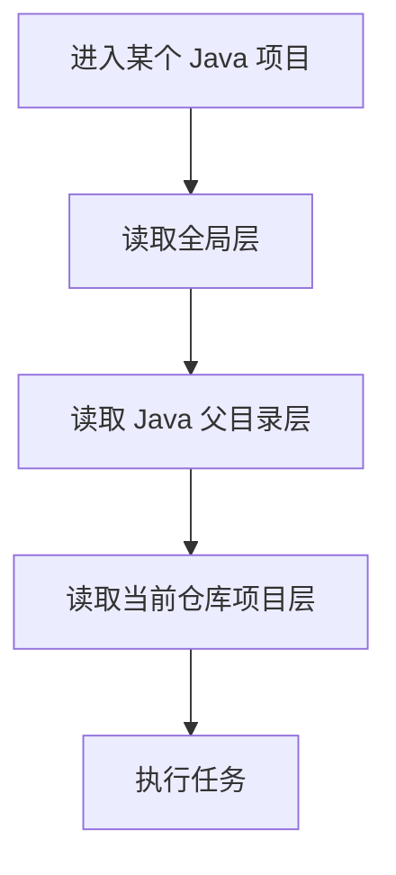
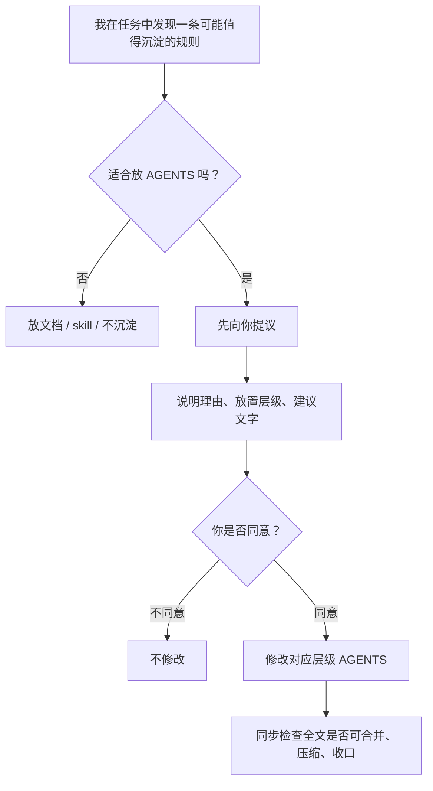

# Agent 使用规范

## 阅读目标

这份文档用于解释当前 Agent 规则的分层机制、放置边界和变更机制，帮助维护者判断：

- 某条规则应该放在哪一层
- 为什么不能什么都往全局层里放
- 什么时候该改全局层、父目录层或项目层
- Agent 在执行任务时会如何理解这些规则

如果你只是想尽快把当前设备跑起来，优先看仓库根目录的 `README.md`；如果你想长期维护这套规则体系，再阅读这份文档。

## 适用对象

这份文档主要面向：

- `agent-config` 仓库维护者
- 会在多台设备上使用 Codex 的使用者
- 需要维护全局层和 Java 父目录层规则的人

它不替代项目仓库内的业务文档，也不替代项目层 `AGENTS.md`。

## 1. 机制总览

Agent 规则按三层管理：

- 全局层：管跨项目通用规则
- 父目录层：管同一技术栈共用规则
- 项目层：管仓库专属规则

规则生效关系如下：

理解方式固定为：

- 越往上越通用
- 越往下越具体
- 执行任务时，会同时受上层和当前层影响
- 更具体的一层，优先解释当前仓库的特殊要求

## 2. 各层该放什么

建议固定成下面这样：

### 全局层放

- 跨项目通用协作规则
- 跨项目通用工具规则
- 跨项目通用环境规则

### 全局层不放

- Java 专属规范
- 前端专属规范
- 某个仓库的业务规则
- 某个仓库的文档同步要求
- 一次性经验

### 父目录层放

- 同一技术栈共享的编码规范
- 同一技术栈共享的注释规范
- 同一技术栈共享的验证方式

### 父目录层不放

- 某个具体仓库的业务规则
- 某个具体仓库的流程约束
- 另一种技术栈的规则

### 项目层放

- 仓库专属业务规则
- 仓库专属文档同步规则
- 仓库专属目录、日志、测试、发布约束

### 项目层不放

- 已经在全局或父目录统一过的通用规则

## 3. 放置判断图

新增规则时，按下面这张图判断放哪一层：

固定判断原则：

- 能跨项目复用的，优先考虑全局层
- 只在同一技术栈内复用的，放父目录层
- 离开当前仓库就不成立的，放项目层
- 更像说明、经验、清单，而不是约束的，优先放文档或 skill，不放 AGENTS

## 4. 当前目录治理方式

当前推荐的长期结构是：

- 全局层：`C:\Users\user\.codex\AGENTS.md`
- Java 父目录层：`C:\project\java-project\AGENTS.md`
- 项目层：各仓库根目录 `AGENTS.md`

对 Java 项目来说，后续默认按这个顺序生效：

这套方式的目标是：

- 不在每个 Java 项目重复写一份通用 Java 规范
- 不让 Java 规则污染别的技术栈

## 5. 变更机制

新增或调整规则时，按下面这条链路处理：

固定执行口径：

- 可以主动判断某条规则是否值得沉淀
- 不能直接把规则写进全局层
- 提议时要说明为什么加、加在哪一层、为什么不放别处
- 只有明确同意后，才能修改对应层级的 AGENTS
- 每次修改后，都要同步检查全文是否需要精简，不能只做追加

## 6. 全局层的特殊约束

全局层最容易膨胀，所以必须额外控增长。

全局层只允许收纳这类内容：

- 不依赖某个仓库
- 不依赖某个技术栈
- 跨项目稳定成立
- 已重复出现，或明显会持续复发
- 不写进去会导致后续重复试错、误判或执行不一致

全局层新增规则时，必须同时满足：

- 先提议，再修改
- 修改时同步检查全文是否能合并或压缩
- 精简时不能丢失原有约束和边界

一句话理解：

- 全局层不是经验堆
- 全局层是跨项目默认规则的最小集合

## 7. 常见例子

下面这些例子可以直接帮助判断放哪层：

- `始终用中文回复`：放全局层
- `修改代码前先说明计划`：放全局层
- `PowerShell 读取文件始终使用 UTF8`：放全局层
- `JavaDoc 必须写清 @param / @return 的业务含义`：放 Java 父目录层
- `布尔返回值必须说明 true / false 的业务结果`：放 Java 父目录层
- `修改预支运费规则时必须同步更新文档`：放项目层
- `某仓库发布前必须执行特定脚本`：放项目层
- `某次排障时总结出的临时经验`：不放 AGENTS，优先放文档

## 8. 对 Agent 的使用预期

可以按下面这组预期理解 Agent：

- 会先识别当前任务属于哪个项目
- 会按“全局层 -> 父目录层 -> 项目层”的顺序理解规则
- 不会默认把任何新经验都塞进全局层
- 会优先把通用规则放高层，把专属规则留低层
- 当认为某条规则值得沉淀时，会先提议，不会直接修改高层规则
- 明确同意后，才会修改，并同步做全文收口

## 9. 一句话版本

如果只记一句话，就记这个：

- 全局管通用
- 父目录管技术栈
- 项目管专属
- 新增先提议
- 同意后再改
- 修改时同步精简全文